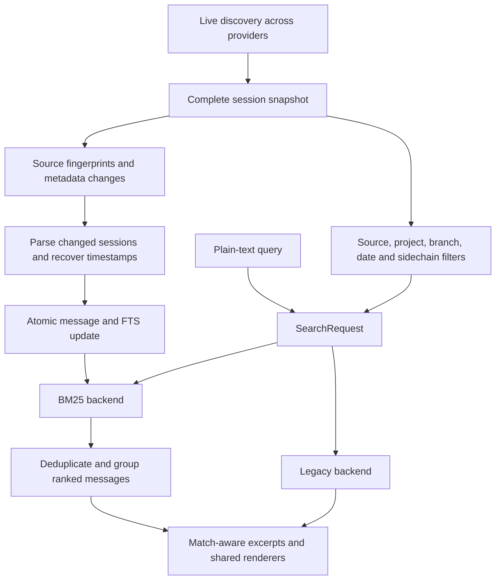

# Incremental BM25 search

Implemented on `feat/bm25-search`. Research snapshot: 2026-09-14.

## Problem and decision

The previous default search returned early when a metadata match crossed a fixed
score threshold. Relevant transcript matches could be omitted entirely. Deep
search reparsed every selected transcript and scored it with manually maintained
technology terms, substring matches and multiplicative boosts.

Use a disposable SQLite FTS5 index with BM25 as the default, and retain the old
engine for comparison. Search metadata and transcript passages in one ranked
candidate stream. Source files remain authoritative; no background service,
model download or network access is required by search.

## Research

CASS was inspected at commit
[`c00350a82192dfcf4a72ec0e3621fe2a5a871ee2`](https://github.com/Dicklesworthstone/coding_agent_session_search/tree/c00350a82192dfcf4a72ec0e3621fe2a5a871ee2).
Its current code differs from older descriptions that identify Tantivy as its
active engine:

- [`src/search/tantivy.rs`](https://github.com/Dicklesworthstone/coding_agent_session_search/blob/c00350a82192dfcf4a72ec0e3621fe2a5a871ee2/src/search/tantivy.rs)
  now routes ingestion and index operations to Quill; a versioned sibling index
  directory distinguishes the new format from Tantivy assets.
- [`src/search/quill_bridge.rs`](https://github.com/Dicklesworthstone/coding_agent_session_search/blob/c00350a82192dfcf4a72ec0e3621fe2a5a871ee2/src/search/quill_bridge.rs)
  provides a synchronous interface over an asynchronous engine and explicitly
  publishes updates through commits.
- [`src/search/query.rs`](https://github.com/Dicklesworthstone/coding_agent_session_search/blob/c00350a82192dfcf4a72ec0e3621fe2a5a871ee2/src/search/query.rs)
  separates ranked candidate identities from hydrated results and makes prefix,
  filter and fallback behavior explicit.

These support three choices here: keep engine boundaries explicit, refresh
derived state incrementally, and publish related records atomically. We do not
copy CASS's daemon, semantic models, runtime bridge, or storage stack.

[SQLite FTS5](https://www.sqlite.org/fts5.html) provides BM25, column weights,
Unicode tokenization and prefix indexes. Its BM25 scores sort ascending and can
be tiny negative numbers. Our adapter negates them; higher positive scores win.
The [BM25 description in Introduction to Information Retrieval](https://nlp.stanford.edu/IR-book/html/htmledition/okapi-bm25-a-non-binary-model-1.html)
explains the collection-frequency, term-frequency saturation and length terms.

| Candidate | Decision for this repository |
|---|---|
| SQLite FTS5 | Selected: already bundled through `rusqlite`; one transaction can update payloads and postings. |
| Tantivy | Reasonable future backend if profiling requires it. Its [architecture](https://docs.rs/crate/tantivy/0.26.2/source/ARCHITECTURE.md) provides configurable analyzers, BM25 and segment-based indexes, but adopting it adds a separate index lifecycle here. |
| CASS's Quill stack | Studied for architecture. Adopting its async/runtime integration would be a substantially larger dependency change than this upgrade needs. |
| Replacing only `score_relevance` | Rejected: it would still parse all transcripts per query and leave the metadata early return in place. |

## Data flow



`SearchBackend::search(&SearchRequest)` is the public replacement boundary.
`Bm25Backend` owns index synchronization and lexical retrieval. `LegacyBackend`
adapts the existing deep scorer. The CLI retains the legacy metadata shortcut
only when `--engine legacy` is selected. Existing callers of `scored_search`
keep their old behavior.

Exact session UUID lookup is shared and runs before indexing. A UUID absent from
the selected sessions becomes a literal token-sequence search. `--scope similar`
continues using the old user-message similarity calculation rather than silently
changing the operation's meaning.

### Storage

`~/.chat-history/cache/search-v1.db` is separate from the existing metadata cache.
It contains:

| Relation | Purpose |
|---|---|
| `sessions` | Composite source/ID/path identity and freshness fingerprint. |
| `messages` | Original serialized message, ordinal, timestamp and scope flags. |
| `passages` | Message reference and bounded searchable text or metadata fields. |
| `passages_fts` | External-content full-text index over the passage fields. |
| Temporary `allowed_sessions` | Per-request filter selection, without large SQL `IN` lists. |

Transcript passages target 1,600 Unicode characters with up to 200 characters of
overlap, aligned to whitespace boundaries. A single longer span stays intact so
chunking never invents a word prefix. Ranking sorts message IDs and scores; it
loads original payloads only for selected candidate messages. Hydration returns
the original message once, using its strongest matching passage.
The backend obtains an FTS5 `snippet()` from that passage using the same query
analyzer. Excerpts are calculated only after accepting a message; neither full
payloads nor snippet text enter the candidate sorter. The original message stays
intact for API consumers. `SearchResult` carries an optional excerpt and up to
two `SearchMatch` children; renderers retain a fallback for the legacy engine.
Titles/project/branch and first-prompt previews have separate metadata records.
First prompts use the timestamp of a matching source user message (including
truncated previews), never an unrelated first message or session modification time. Title metadata uses session activity time.

Changes replace a session's rows. Cascading deletes and FTS triggers maintain
postings in the same transaction. The database filename versions the schema; an
extraction version in each fingerprint invalidates unchanged sources when parser,
timestamp, chunking or tokenization policy changes. Missing derived FTS assets
are rebuilt transactionally from existing passage rows. Incomplete payload tables
are treated as an unavailable cache, not an empty corpus.

### Freshness and failure handling

- Discovery supplies the complete corpus before search filters are applied, so
  changing a project or source filter does not change collection statistics.
- Fingerprints reuse the metadata cache's size, mtime, Unix ctime/inode/mode and
  two-second racy-file policy. SQLite WAL/journal files are included. Non-Unix
  filesystems lack the additional ctime/inode checks; same-size edits with restored
  mtimes can require `--rebuild-index` there.
- Cursor dependencies use a per-conversation BLAKE3 digest of raw bubble,
  composer-data and composer-header rows, read in one SQLite snapshot. Indexed
  range and point queries stream these values without deserializing JSON or
  sorting large payloads. IDE sessions depend on these rows; Agent JSONL sessions
  also depend on the database for timestamp recovery. Session metadata and the
  enrichment profile remain fingerprinted.
- Stable database/WAL observations allow digest reuse. After a shared-database
  change, hashes are recomputed and only changed conversations are parsed.
  Updating the observation alone does not replace postings: an unchanged
  conversation has its stored observation refreshed in one best-effort write, so
  later searches reuse the digest until the database changes again. This still reads
  conversation bytes; it is not a change feed. Cached read connections reopen
  when the database file identity changes, including atomic replacement on Unix.
- Fingerprints are versioned objects. Older serialized arrays cause a one-time
  conservative refresh; identical extracted payloads can still retain postings.
- Stable unchanged sessions skip transcript parsing. Changed sources are checked
  before and after parsing. Unstable or failed reads are retried next invocation.
  Empty parses of SQLite-backed sources also retry. An empty parse is kept for
  deliberately metadata-only CLI stores and for plain transcript files that read
  cleanly from start to end (for example a lone `turn_ended` record).
- Changed sources parse in parallel batches of at most eight sessions using the
  existing Rayon pool. Index writes stay serial and transactional. This bounds
  the number of parsed transcripts held at once, though an individual transcript
  can still be large.
- After a source changes, identical extracted message payloads retain their
  postings. This avoids rewriting every Cursor transcript when unrelated data
  changes in its shared IDE database. Complete payloads and ordinals are compared;
  rebuild requests and extraction-version changes still regenerate passages.
- Sessions absent from the discovery snapshot are removed from this disposable
  index. An unavailable source may therefore be indexed again when it returns;
  its original files are never changed.
- WAL supports concurrent readers. Synchronization commits before retrieval so
  a write lock is not held across ranking. Another profile that replaces the
  cached corpus between those steps is retried, then falls back to in-memory
  BM25. Lock contention or an unreadable/corrupt cache also causes an in-memory
  rebuild with a stderr warning. If a cache write cannot be saved, search still
  returns results from an ephemeral index.
- `CHAT_HISTORY_NO_CACHE=1` bypasses both disk caches. `search --no-cache` bypasses
  the search index only. New directories/files use Unix modes 0700/0600.
- `--rebuild-index` reparses all sessions in a usable index. A database that
  reports corruption while opening, synchronizing or matching is reset in place
  once per invocation and refilled, unless `quick_check` and the FTS
  `integrity-check` show that another process already repaired it. The file is
  never unlinked. If the reset fails, search falls back to memory.

### Query and ranking policy

Input is plain text. Whitespace-delimited chunks are deduplicated and safely
quoted, including embedded quotation marks. At most 128 distinct chunks or
analyzer tokens become clauses, so a pasted log cannot build an unbounded
expression. Unicode61 analyzes both indexed
text and query chunks with `remove_diacritics 2`, so composed and combining
diacritics fold to the same tokens. Punctuation separates
identifier/path components inside one adjacent token sequence, so a filename
query does not become a broad OR over `src`, a basename and an extension.
Chunks with at least two alphanumeric characters match both the exact sequence
and a prefix of their final token. Exact matches contribute their own IDF in
addition to the prefix contribution, so `WAL` has an advantage over `wall` or
`Waltham`. Single-character chunks use exact matching. Chunks are ORed for recall. There is
no executable FTS syntax, stopword list, hardcoded technology vocabulary,
stemming, typo correction or arbitrary infix matching.

Field weights are content 1, title 3, first prompt 2, project/branch 0.5. Use
BM25's length normalization over passages. The positive BM25 score is multiplied
by `1 + 0.25 * complete + 0.15 * phrase`: complete means all distinct query chunks
match the passage (exact or prefix); phrase means the original query's analyzed
token sequence occurs in order. Both bonuses apply only to multi-chunk queries.
Separate FTS match sets provide these signals without excluding partial matches.
These are explicit initial policy weights, not learned or proven optimal values.
Newer timestamps break equal-score ties, followed by stable
session/ordinal ordering. JSON preserves the numeric score without rounding tiny
values to zero. Scores are ranking signals, not probabilities.

Source selection and timestamp/scope predicates are applied before consuming the
ranked stream. Duplicate passage IDs and identical trimmed message text/role/
tool/file tuples are collapsed within a conversation without erasing numbers,
case, quotes or suffixes. The same text in another session remains a separate
hit. At most three messages per source/session ID are accepted across file copies.
BM25 defaults to one result per logical conversation, with the highest-ranked
message first and up to two additional matches. The limit counts conversations;
`--group-by message` restores individual message rows. No fixed candidate cutoff
lets one busy session starve other sessions. Grouped retrieval continues through
the stream to find children for selected groups, stopping when each selected
group has three matches or the stream is exhausted. Sparse groups can therefore
require traversing the full ranked stream, although accepted hydration is capped
at three messages per group (duplicate payload checks can add hydration).
The synthetic title and prompt rows usually repeat the first user message. Within
a conversation a synthetic row whose cleaned text is a prefix of (or prefixed by)
an accepted user message or other synthetic row is dropped, and a user message
that arrives after its synthetic echo replaces it at the same rank, so one
sentence cannot occupy all three slots.
`--source cursor-ide` includes canonical Agent transcript rows marked `also_ide`.
`--source cursor-agent` also retains CLI stores represented by readable IDE rows;
that selection performs a separate cached Agent membership discovery.

## Compatibility and tradeoffs

- BM25 is the CLI default. `--deep` remains accepted; it matters only to the
  legacy metadata shortcut. `CHAT_HISTORY_SEARCH_ENGINE=legacy` restores that
  behavior, and an explicit `--engine` takes precedence.
- Default JSON now always has the former deep-search result fields. Legacy
  metadata results still have `matched_field` and `search_type: index`. Message
  results also expose `additional_matches`; ungrouped rows use an empty array.
  `CHAT_HISTORY_SEARCH_GROUP_BY` controls grouping with explicit flag precedence.
  Legacy and similarity searches retain their previous defaults.
- Relevance ordering and counts intentionally change. Short messages remain
  eligible; multiple terms need not all match. A metadata match cannot suppress
  transcript retrieval. Legacy substring and importance heuristics remain in the
  legacy engine; BM25's coverage and phrase weights are separately defined above.
- Cold indexing has an up-front parsing/storage cost. Warm searches still stat
  the discovered sources; they are not constant-time with respect to session count.
- Extremely broad queries may sort many matching passages. More specialized
  top-k retrieval, native code tokenizers and semantic fusion should follow
  measurements and relevance judgments, not be added preemptively.
- Source parsers currently expose empty results rather than structured read
  errors. Empty parses are therefore trusted only for plain files that were
  re-read successfully, never for SQLite-backed sources.
- A shared Cursor database has no change feed. While Cursor is writing to it,
  each search after a write re-hashes every dependent conversation (about one
  second for 620 conversations on a 3.4 GB store) before the digests are reused.
- FTS damage that raises no SQLite error (a segment that decodes to nothing) is
  not detected at query time; `--rebuild-index` repairs it.

## Validation

`tests/search_bm25.rs` covers rare-term ranking, metadata/transcript recall,
Unicode/prefix/path queries, literal query syntax, passage collapse, per-session
limits, filtering and score stability, timestamp provenance, scopes, persistent
refresh/rebuild/deletion, WAL-only edits, cache failures, UUIDs and CLI selection.
Follow-up tests cover winning-passage excerpts, coverage and phrase ordering,
group filling and JSON children, unrelated Cursor writes, same-size WAL changes,
and atomic database replacement.
The original CLI and Cursor reliability suites exercise the new default; the two
metadata-output contract tests explicitly select the legacy engine.

An eight-query synthetic fixture spans rare identifiers, filenames, error codes,
acronyms, Unicode accents, separator normalization, multiple terms and prefixes.
BM25 achieved Recall@5 8/8 and MRR@5 1.000; legacy achieved 6/8 and 0.750. This
fixture tests intended behaviors, not an independently collected relevance
benchmark or a claim of universal superiority. Reproduce it with
`cargo test --test search_bm25 judged_query_fixture -- --nocapture`.

The reproducible synthetic benchmark is:

```sh
cargo test --release --test search_bm25 benchmark_cold_warm_and_legacy -- --ignored --nocapture
```

It creates 250 sessions and 5,000 messages in a temporary directory, measures
cold synchronization, a reopened warm index, one BM25 query and the legacy deep
query, and verifies warm synchronization reparses zero sessions. These are local
synthetic measurements, not claims about all real histories or relevance quality.

Post-review macOS arm64 release run (2026-09-14), excluding source discovery:

| Operation | Time |
|---|---:|
| Cold open + index build | 191.3 ms |
| Warm reopen + freshness validation | 1.20 ms |
| Warm BM25 query | 0.33 ms |
| Legacy deep query | 45.6 ms |

These are single-run observations on a narrow query (`marker137`), not p95
latencies. The combined warm BM25 path took about 1.53 ms in this fixture.

Before tuning defaults further, collect representative queries with expected
sessions and compare Recall@5/MRR across both engines, especially exact errors,
filenames, short acronyms, verbose queries and old but relevant conversations.
